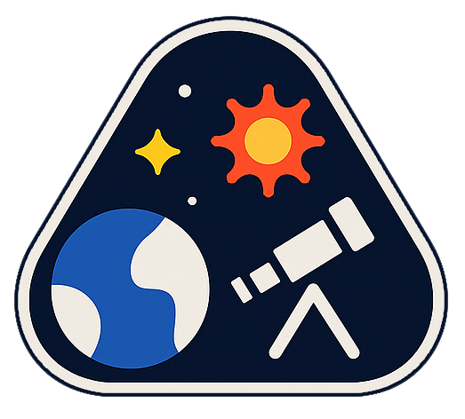
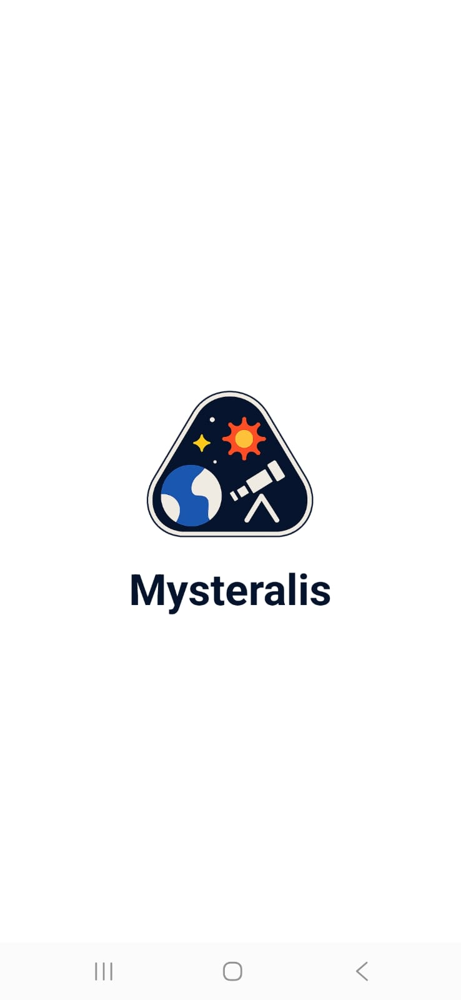
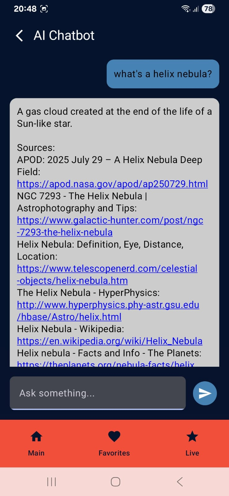
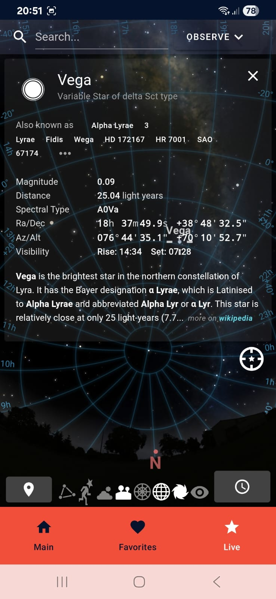
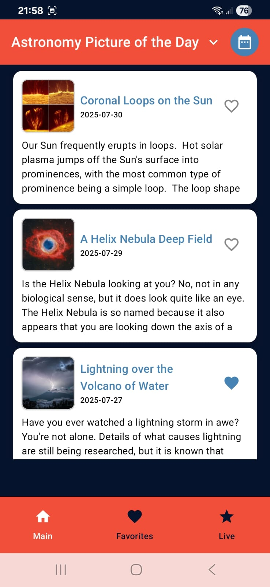
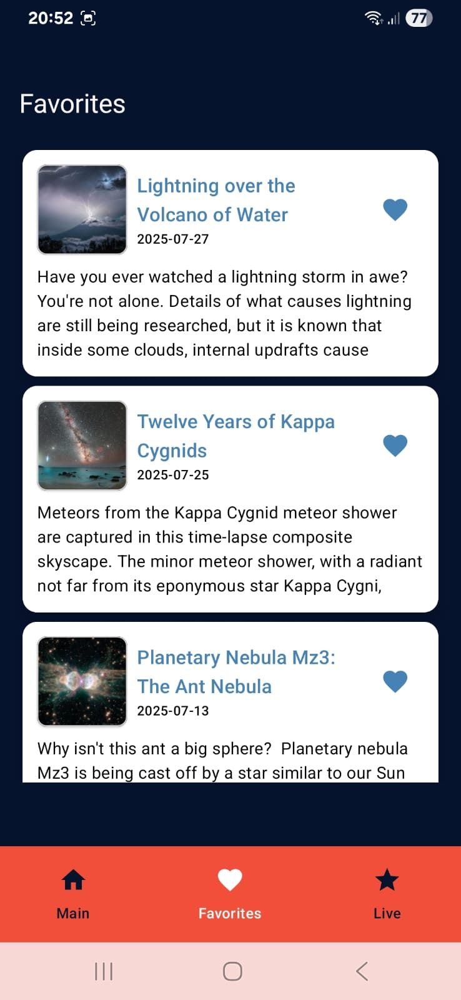
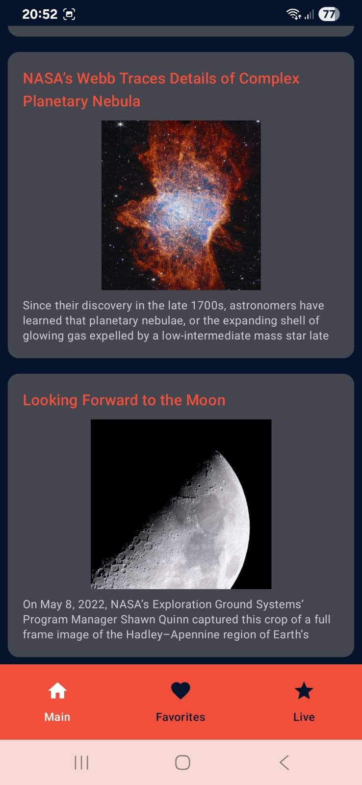

  

<h1 align="center">Mysteralis 🌌</h1>

  Explore the universe through real-time NASA data, AI assistance, and interactive sky tracking — all in a single Android app.

---

## Overview

**Mysteralis** is a modern Android application that blends NASA’s open data with AI technologies and live astronomical visuals. It allows users to explore daily space pictures, read astronomy news, ask AI-driven space questions, and observe the sky in real-time.

---

##  Features

-  **NASA APOD Integration** – Daily Astronomy Picture of the Day with explanations  
-  **NASA News Feed** – Powered by **Spaceflight News API** for real-time space updates  
-  **AI Chatbot** – FLAN-T5 model via Hugging Face, answers space-related questions with source links  
-  **Live Sky Tracking** – Integrated with **Stellarium Web Engine** to explore the night sky  
-  Save and view your favorite images  
-  Source-enhanced AI responses using **DuckDuckGo API**

---

##  Tech Stack

- **Kotlin + Jetpack Compose**
- **MVVM Architecture**
- **Retrofit** for REST API integration (NASA, Hugging Face, News)
- **Room DB** for local favorites
- **Coil** for image loading
- **Stellarium Web Integration** (JS-based sky viewer)
- **Flask API** + **Hugging Face Space (FLAN-T5)** for AI responses

---

## 📽 Demo Video

  

---

##  Screenshots

  
  
  
  
  
  
  
  

---

##  External Services

- [NASA APOD API](https://api.nasa.gov/)
- [Spaceflight News API](https://spaceflightnewsapi.net/)
- [Stellarium Web](https://stellarium-web.org/)
- [Hugging Face - FLAN-T5](https://huggingface.co/google/flan-t5-base)
- [DuckDuckGo Search API](https://duckduckgo.com/)

---
